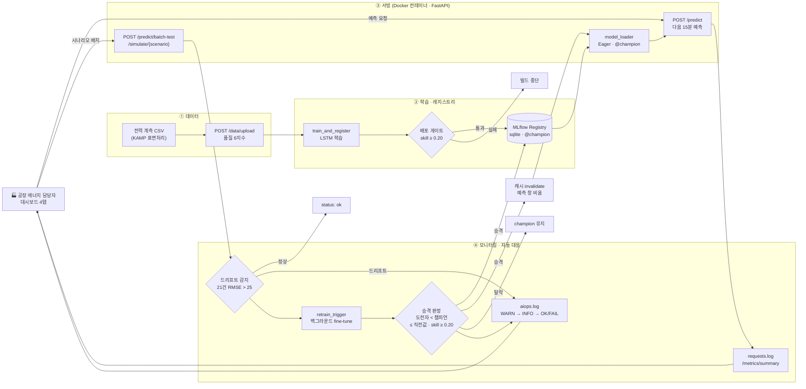

# 부식방지 도금공장 15분 전력 예보 — 모델 서빙 · AIOps

> 철강 부품에 아연을 입혀 녹을 막는 **아연도금(부식방지 표면처리) 공장**의 에너지 담당자에게
> "15분 뒤 전력이 얼마나 나올지"를 미리 알려 주는 B2B 예측 서비스.
> 산업용 전기 기본요금은 15분 단위 최대수요전력으로 정해지므로, 15분 앞을 알면 설비 기동을 나눠 피크를 피할 수 있다.

전기아연도금(표면처리) 공장의 15분 단위 전력 지표 `Power_Usage` 를 **최근 5시간(20칸)** 으로 보고
**다음 15분 값**을 LSTM 으로 예측하는 FastAPI 서빙 서버다. MLflow 로 학습·등록하고,
예측 오차가 커지면(드리프트) 서버가 **실제로 받은 최근 관측**으로 백그라운드 fine-tune 을 돌려
도전자가 이기면 champion 을 교체한다. 대시보드·업로드·품질 리포트·운영 지표까지 컨테이너 하나에 들어 있다.

설계의 정본은 [`docs/SPEC.md`](docs/SPEC.md), API 요청·응답 예시는 [`docs/API.md`](docs/API.md).

---

## 한눈에 보기

| 항목 | 내용 |
|---|---|
| 예측 대상 | 다음 15분 전력 지표 `Power_Usage` (범위 39 ~ 270) |
| 입력 | 최근 20칸 = 5시간 (전력값 + 시각·요일 특징 4개) |
| 모델 | LSTM 32 → 32 → 16 + Dense 16 → Dense 1 |
| 성능 | val RMSE 10.90 · 직전값(naive) 대비 43% 개선 (skill 0.430) |
| 배포 기준 | 직전값 대비 20% 이상 개선해야 배포 |
| 드리프트 감지 | 최근 21건 예측 오차(RMSE) > 25 |
| 대응 | 감지 → 백그라운드 재학습 → 검증 통과 시 자동 교체 |

---

## 도메인 매핑표

입력·게이트·드리프트·재학습을 이 서비스 기준으로 정의한 값과, 그 값이 구현된 코드 위치다.

| 항목 | 값 | 어디 |
|---|---|---|
| 예측 대상 | **다음 15분 전력 지표 `Power_Usage`** (원본 범위 39 ~ 270) | `serving_app/schemas.py` |
| 입력 시퀀스 | **최근 20칸 = 5시간** (전력값 + 달력 4개 `tod_sin` `tod_cos` `dow_sin` `dow_cos`). 15분 간격·빈칸 없음, 구간 경계를 넘는 창 금지 | `data/features.py` |
| 데이터 공급 | **공장 전력 계측 CSV 업로드** (`POST /data/upload`, 필수 `Datetime`·`Power_Usage`, 최소 41행) → 6지수 품질 리포트. 초기 학습은 KAMP 표면처리 데이터 | `serving_app/routers/data.py`, `data/quality.py` |
| 배포 게이트 | **직전값 대비 20% 이상 개선** (`skill = 1 − val_rmse / naive_val_rmse ≥ 0.20`). 절대값 RMSE ≤ 25 는 직전값(19.12)도 통과해서 의미가 없다. champion v1 은 skill 0.430 | `serving_app/train_and_register.py` |
| 드리프트 신호 | **신규 피도금체 투입**(조업 시간 × 1.35) · **정류기 효율 저하**(+40, σ 20) · **조업 시간 변경**(교대 4시간 앞당김). 판정은 최근 21건 RMSE > 25 | `data/simulate.py`, `serving_app/monitoring/drift_detector.py` |
| 재학습 | **서버가 실제로 받은 최근 관측 212칸**으로 champion 가중치에서 fine-tune (10 epoch, lr 1e-4), 백그라운드 스레드 | `serving_app/monitoring/retrain_trigger.py` |
| 재배포 판정 | 홀드아웃에서 **도전자 < 챔피언 · 도전자 ≤ 직전값 · 기준 세트 skill ≥ 0.20** 셋 다 만족해야 alias `champion` 이동. 하나라도 지면 기존 champion 유지 | `serving_app/train_and_register.py` |
| 알림 | `logs/aiops.log` **[WARN] → [INFO] → [OK]/[FAIL]** → `/logs/alerts` → 대시보드 「최근 알람」. 실제 운영이면 공장 에너지 담당자 메신저로 보낸다 | `serving_app/monitoring/` |
| 이해관계자 | **공장 에너지·설비 담당자**(피크 관리·설비 기동 조정) · **생산관리자**(조업 스케줄) · **경영진**(전기요금 = 도금 원가) · 서비스 운영자(MLOps) | — |

---

## 설계 결정

입력 특징·모델 구조·학습 설정은 여러 후보를 비교해 정했다. 서빙 코드는 이 값을 바꾸지 않는다.

| 결정 | 값 | 근거 |
|---|---|---|
| 입력 특징 | `Power_Usage` + 달력 4개(`tod_sin` `tod_cos` `dow_sin` `dow_cos`) = **5개** | 시각 정보가 핵심(없을 때 대비 z +2.82). 생산량·온습도·인력은 더해도 차이 없음 → 입력 단순화 |
| 입력 길이 | `SEQ_LEN = 20` (5시간) | 8 ~ 96 칸 사이 차이 없음 |
| 모델 | LSTM 32 → 32 → 16 + Dense 16(relu) → Dense 1, MSE, Adam **lr 3e-3** | 3e-3 이 1e-3 보다 낫다 (z −2.0 ~ −2.44) |
| 학습 | batch 64, 최대 200 epoch, EarlyStopping(val_loss, patience 10, 최적 가중치 복원), seed 42 | 고정 epoch 은 상한에 걸려 덜 배웠다 |
| 결정론 | `keras.utils.set_random_seed(42)` + `enable_op_determinism()` | 같은 기기·같은 플랫폼(OS·CPU)에서 같은 결과. 플랫폼이 다르면 가중치가 달라진다 — 맥 val 10.90 / test 11.48, Docker(Linux) val 10.69 / test 10.92 |
| 성능 | val RMSE ≈ **10.9**, test ≈ **11.4** | 직전값(naive) val 18.62 / test 19.04 |

**이 코드로 전체 학습한 실측 (맥북 CPU, seed CSV)**

| 단계 | 결과 |
|---|---|
| `scripts/train_baseline_v1.py` | 정제 23,519행 · 시퀀스 train 16,343 / val 3,468 / test 3,508 · best_epoch 38/48 (조기 종료) · **val 10.90 · test 11.48** (직전값 19.12 / 19.12) · skill 0.430 · 61초 |
| `serving_app/train_and_register.py` | `[GATE PASSED] skill=0.430 >= 0.20 (val_rmse=10.90, naive=19.12, test_rmse=11.48, best_epoch=38/48) -> Surface_Power_Predictor v1 @champion` · 66초 |

서빙·운영 쪽 숫자 (`serving_app/config.py`, `serving_app/train_and_register.py`):

| 값 | 설정 | 근거 |
|---|---|---|
| 드리프트 창 | `DRIFT_WINDOW = 21` (5시간 15분) | 최근 예측 21건으로 이동 RMSE 를 계산 |
| 드리프트 임계 | `DRIFT_THRESHOLD = 25.0` | 정상 기간 21건 이동 RMSE p99: val 23.1 · test 26.2, 25 초과 비율 val 0.4% · test 1.4%. 직전값 19 보다 위여야 "평소보다 확실히 못 맞힌다" |
| 배포 게이트 | `GATE_MIN_SKILL = 0.20` — `1 − val_rmse / naive_val_rmse ≥ 0.20` | 절대값(RMSE ≤ 25)은 직전값(19)도 통과한다 |
| 재학습 데이터 | 최근 관측 `OBS_BUFFER = 20 + 96 × 2` = 212칸 | 하루치(96)만으로는 80/20 홀드아웃이 20건뿐이라 비교가 흔들린다. 다만 정상 → 같은 seed 드리프트, 96칸 배치 흐름에서는 버퍼가 언제나 116칸이라 **실제 승격 판정은 홀드아웃 20건**이다 — 이틀치 판정을 보려면 `n_targets=192` 로 보낸다 |
| fine-tune | 챔피언 가중치에서 warm start, `FT_EPOCHS = 10`, `FT_LR = 1e-4` | 적은 데이터로 scratch 학습은 불안정 |
| 승격 조건 | 홀드아웃에서 `도전자 < 챔피언` **그리고** `도전자 ≤ 직전값`, **그리고** 도전자의 기준 세트(학습 CSV 의 val) skill ≥ `GATE_MIN_SKILL` | 같은 시점·같은 데이터로 셋을 비교한다. 셋째 조건은 모든 champion 이 처음 배포 기준과 같은 기준을 만족하게 한다 — 연쇄 4회 승격한 v9 는 val skill 0.157 인데 서빙됐다(첫 승격 v2 는 0.280 으로 통과) |

서빙 코드(`train_baseline_v1.py`·`train_and_register.py`)가 재는 직전값 val RMSE 는 **19.12** 다.

참고 기준선 (예측 시점에 아는 정보만):

| 기준선 | val | test |
|---|---|---|
| 직전값 | 18.62 | 19.04 |
| RandomForest (과거값 + 달력) | 10.82 | 10.97 |
| slot_ar (시각 슬롯별 선형 자기회귀) | 10.44 | 9.97 |

단일 LSTM 은 slot_ar 를 넘지 못한다. 이 프로젝트의 목표는 서빙·AIOps 루프이고 모델 구조는 단순하게 유지했다.
오차는 07시(조업 시작 직전)에 몰린다.

---

## 데이터

**KAMP 「표면처리 자원최적화 AI 데이터셋」** 의 `Resource_Management_Process.csv`.

| 항목 | 값 |
|---|---|
| 원본 | 24,479행, 2021-02-08 00:15 ~ 2021-10-21 23:45, 15분 간격 |
| 컬럼 | `Datetime,Production,Temperature,Humidity,Power_Cost,DoW,Worker_Power,Man_Cost,Power_Usage` |
| `Power_Usage` 범위 | 39 ~ 270 (평균 136.5) |
| 정제 ① | 같은 시각이 두 번 이상 나오는 **날짜는 그날 전체 제외** — 2021-03-07 · 05-07 · 07-07 · 10-07, 960행 |
| 정제 ② | 15분 간격이 끊기는 곳마다 구간(`seg`)을 나눈다. 입력 창은 구간 경계를 넘지 않는다 |
| 정제 ③ | `Humidity` 음수(16셀) → 0 |
| 정제 후 | **23,519행, 구간 10개** |
| 분할 | 행 기준 시간순 70 / 15 / 15 → 경계 2021-08-05 12:00 · 2021-09-14 06:00 |
| 품질 6지수 | 완전성 0.2 · 유일성 0.2 · 유효성 0.2 · 일관성 0.15 · 정확성 0.15 · 무결성 0.1. 원본은 유일성 97.65 (중복 576행), 정확성 < 100 (습도 음수 16셀) |

### 데이터·문서는 git 에 없다

**seed CSV 와 가이드북 PDF 는 커밋하지 않는다** (`.gitignore` 의 `data/seed/*.csv`).
공개 재배포 가능 여부를 확인하지 못했고, 가이드북에는 개인 ID 가 들어 있다.
처음 받으면 KAMP 에서 데이터셋을 내려받아 **`data/seed/Resource_Management_Process.csv`** 로 넣는다
(폴더는 `data/seed/.gitkeep` 으로 git 에 들어 있다. 없으면 `mkdir -p data/seed`, Windows 는 `mkdir data\seed`).
Docker 빌드도 이 파일이 있어야 된다 (`.dockerignore` 는 seed CSV 를 빼지 않으므로 이미지 안에는 들어간다 —
이미지를 공개 레지스트리에 올리지 말 것).

---

## 구조

```
serving/
├── requirements.txt
├── docs/
│   ├── SPEC.md                    # 구현 정본 — 이름·시그니처·응답 형식
│   └── API.md                     # 엔드포인트별 요청·응답 예시
├── data/
│   ├── features.py                # 정제·달력·Scaler·시퀀스 (학습·서빙·재학습 공용 정본)
│   ├── quality.py                 # 품질 6지수 리포트
│   ├── simulate.py                # 업무 규칙 시뮬레이션 (정상 재생 + 드리프트 3종)
│   ├── storage.py                 # latest_upload() · seed_csv()
│   ├── seed/                      # KAMP 원본 CSV (git 제외)
│   └── uploads/                   # 업로드 CSV 가 쌓이는 곳 (git 제외)
├── scripts/
│   ├── train_baseline_v1.py       # train 구간으로만 scaler fit + 로컬 모델 power_v1.keras
│   ├── simulate_drift.py          # 시나리오 배치 → /predict/batch-test
│   └── e2e_check.py               # 살아 있는 서버로 전체 루프 점검 (PASS/FAIL 체크리스트)
├── serving_app/
│   ├── main.py                    # 앱 조립, 미들웨어, 라우터, 정적 대시보드(마지막 mount)
│   ├── config.py                  # 드리프트 창·임계·관측 버퍼·로그 경로
│   ├── schemas.py                 # Point · PredictRequest/Response · BatchTest*
│   ├── lstm_model.py              # build_model(lr=3e-3)
│   ├── model_loader.py            # local ↔ mlflow(@champion), Lazy/Eager, invalidate()
│   ├── train_and_register.py      # scratch 학습·게이트·등록 / fine_tune / list_versions / champion_info
│   ├── routers/                   # predict · health · data · logs · simulate · retrain · metrics · registry · config
│   ├── monitoring/                # drift_detector · retrain_trigger · state · request_log
│   ├── static/index.html          # 대시보드 4탭 (외부 의존 없음)
│   ├── models/                    # scaler.pkl · power_v1.keras (생성물, git 제외)
│   └── Dockerfile · docker-compose.yml
└── tests/                         # pytest (3분 이내)
```

### 아키텍처 구성도



---

## 로컬 실행

모든 명령은 **프로젝트 루트(`serving/`)** 에서 실행한다. import 경로가 `data.*` · `serving_app.*` 이다.

```bash
# 0) 환경 (Python 3.11)
python3.11 -m venv .venv
.venv/bin/pip install -r requirements.txt
mkdir -p data/seed      # 여기에 Resource_Management_Process.csv 를 넣어 둔다 (위 「데이터」)

# 1) 로컬 baseline — train 구간으로만 scaler fit → serving_app/models/scaler.pkl, power_v1.keras
.venv/bin/python scripts/train_baseline_v1.py

# 2) MLflow 학습·등록 — run "base-train" → 게이트 → 통과하면 alias champion
.venv/bin/python serving_app/train_and_register.py      # [GATE PASSED] ... 가 찍혀야 한다

# 3) 서버 (8000). 워커는 1개 — 드리프트 창·관측 버퍼·재학습 상태가 프로세스 메모리에 있다
MODEL_SOURCE=mlflow LOADING_MODE=eager .venv/bin/uvicorn serving_app.main:app --port 8000
#    MODEL_SOURCE 를 빼면 local(power_v1.keras, 버전 "v1-local"). 재학습 승격이 응답에 안 보인다
#    --reload 를 켜면 파일 저장 때마다 프로세스가 새로 떠서 위 상태가 사라진다

# 4) 대시보드
open http://localhost:8000/              # /#dashboard  /#simulation  /#datasets  /#system
open http://localhost:8000/docs          # Swagger

# 5) 드리프트 시뮬레이션 (다른 터미널)
.venv/bin/python scripts/simulate_drift.py --scenario normal                  # drift_check.status = ok
.venv/bin/python scripts/simulate_drift.py --scenario equipment_fault --wait  # retrain_triggered → done
tail -n 5 logs/aiops.log      # [WARN] drift detected → [INFO] retrain triggered → [OK] ... champion promoted

# 6) 전체 루프 점검 — 종료 코드 0 이면 FAIL 없음. 새로 띄운 서버(빌드·학습 직후 champion)에서 돌린다
.venv/bin/python scripts/e2e_check.py --url http://localhost:8000 --timeout 600

# 7) 테스트
.venv/bin/python -m pytest -q

# (선택) MLflow UI — macOS 는 5000 번을 AirPlay 가 쓰므로 5001
.venv/bin/mlflow ui --backend-store-uri sqlite:///mlflow.db --port 5001
```

**Windows (PowerShell)** — 위 0 ~ 7단계와 같은 순서.

```powershell
# Windows (PowerShell). 프로젝트 루트에서
py -3.11 -m venv .venv
.venv\Scripts\python -m pip install -r requirements.txt
mkdir data\seed -Force        # 여기에 Resource_Management_Process.csv
.venv\Scripts\python scripts\train_baseline_v1.py
.venv\Scripts\python serving_app\train_and_register.py
$env:MODEL_SOURCE="mlflow"; $env:LOADING_MODE="eager"   # 이 터미널이 닫힐 때까지 유지된다. local 로 되돌리려면 Remove-Item Env:MODEL_SOURCE
.venv\Scripts\python -m uvicorn serving_app.main:app --port 8000
Start-Process http://localhost:8000/
.venv\Scripts\python scripts\simulate_drift.py --scenario equipment_fault --wait
Get-Content logs\aiops.log -Tail 5 -Encoding UTF8       # -Encoding 을 빼면 PowerShell 5.1 에서 한글이 깨진다
.venv\Scripts\python scripts\e2e_check.py --url http://localhost:8000 --timeout 600
.venv\Scripts\python -m pytest -q
.venv\Scripts\python -m mlflow ui --backend-store-uri sqlite:///mlflow.db --port 5001
```

- cmd 는 권하지 않는다. 꼭 쓰면 `set "MODEL_SOURCE=mlflow"` · `set "LOADING_MODE=eager"` 를 한 줄씩 따로 쓴다.
  `set X=mlflow && ...` 는 값 끝에 공백이 붙는다 (서버는 값의 앞뒤 공백·대소문자를 정리해서 읽는다).
- 출력을 파일로 리디렉션(`> e2e.txt`)하거나 파이프로 넘기면 stdout 이 cp949 가 된다. CLI 세 개는 못 찍는 문자를 `?` 로 바꿔
  죽지 않는다. Git Bash 처럼 UTF-8 터미널에서 한국어가 깨지면 `set PYTHONUTF8=1` (PowerShell: `$env:PYTHONUTF8=1`) —
  PowerShell 리디렉션에서는 오히려 한국어가 깨지니 기본값으로 권하지 않는다.

`simulate_drift.py` 인자: `--scenario {normal,new_product,equipment_fault,schedule_shift}` · `--seed` (시작점) ·
`--url` · `--n_targets` (기본 96 = 하루, 21 이상) · `--wait` · `--timeout`.
`e2e_check.py` 인자: `--url` · `--timeout` · `--scenario` (기본 `equipment_fault`) · `--seed` · `--n_targets` ·
`--mode {simulate,batch-test}` · `--dump <json>` (요청·응답 원문 저장).

e2e 의 11개 점검: health → config → predict 200 → predict 422(19개·간격·0) → 정상 배치 ok → 드리프트 배치 retrain_triggered →
retrain/status done → champion 버전 바뀜 → /predict model_version 바뀜 → 알람 WARN → INFO → OK → **승격 뒤 정상 배치 ok(재경보 없음)**.

e2e 를 읽을 때 알아 둘 것.
- 정상 배치와 드리프트 배치에 **같은 seed** 를 쓴다 → 같은 기간이라 관측 버퍼에서 드리프트 값이 정상 값을 덮는다.
  재학습은 드리프트가 걸린 하루치(116칸)로 돈다.
- 한 번 승격된 champion 은 드리프트 데이터에 맞춰진 모델이라, 같은 서버에서 다시 돌리면 **정상 배치가 드리프트로 판정**될 수 있다.
  e2e 는 그 재학습이 끝나기를 기다렸다가 기준을 다시 잡고 이어 가지만, 5번은 FAIL 로 남는다. 깨끗한 결과는 새로 띄운 서버에서.
- 도전자가 지면(챔피언 유지) 8번이 FAIL 이다. 게이트가 막은 것 자체는 정상 동작일 수 있으니 같은 줄의 `reason` 을 본다.
- 4번이 422 를 일부러 세 번 보내므로 `/metrics/summary` 의 `errors` 가 그만큼 오른다.
- 11번은 승격 직후 첫 정상 배치가 새 champion 으로 판정되고 곧바로 재경보가 나지 않는지 본다. 배치 하나(96건)가
  21건 창을 통째로 채우므로 "윈도우를 비웠는가" 자체는 `tests/test_drift.py` 가 단위로 본다.

---

## Docker

```bash
# 프로젝트 루트에서. data/seed/*.csv 가 있어야 빌드된다
docker compose -f serving_app/docker-compose.yml up --build
#   또는
docker build -f serving_app/Dockerfile -t surface-power-serving .
docker run --rm -p 8000:8000 surface-power-serving

.venv/bin/python scripts/e2e_check.py --url http://localhost:8000
# Windows: .venv\Scripts\python scripts\e2e_check.py --url http://localhost:8000
```

- 빌드 안에서 `data/seed/*.csv` → `data/uploads/build_seed.csv` → baseline → `train_and_register` 까지 끝낸다.
  학습을 두 번 하므로 첫 빌드는 수 분 걸린다. 이미지는 TensorFlow 때문에 **약 3GB** (pip 층 2.5GB).
- 실제 빌드 실측(맥북 Docker): 학습 단계 약 180초 안에서
  `[GATE PASSED] skill=0.441 >= 0.20 (val_rmse=10.69, naive=19.12, test_rmse=10.92, best_epoch=47/57)` 까지 됐고,
  띄운 컨테이너에 `e2e_check.py` PASS 11 · FAIL 0. 맥북에서 학습한 champion(val 10.90)과 가중치가 다르다 — 「설계 결정」 결정론 행.
- 게이트를 못 넘어 champion 이 없으면 **빌드가 멈춘다.** 그대로 두면 기동 때 Eager 로드가 실패해 컨테이너가 바로 죽기 때문이다.
- `MODEL_SOURCE=mlflow`, `LOADING_MODE=eager`, 포트 8000. 헬스체크는 `/health` 의 `status` 가 `ok` 인지 본다
  (Eager 로드가 실패해 `/predict` 가 전부 503 이면 `degraded` → unhealthy).
- 재학습으로 승격된 버전은 **컨테이너 안 `mlflow.db` 에만** 있다. 컨테이너를 지우면 빌드 때의 champion 으로 돌아간다.

---

## 엔드포인트

| Method | URL | 역할 |
|---|---|---|
| POST | `/predict` | 20칸(15분 연속) → 다음 15분 예측 |
| POST | `/predict/batch-test` | 연속 행(≥ 41) → 슬라이딩 예측, 관측 버퍼·예측 창 누적, 드리프트 판정 → 드리프트면 **백그라운드** 재학습 |
| POST | `/simulate/{scenario}?seed=&n_targets=` | 서버가 시나리오 배치를 만들어 batch-test 와 같은 처리 |
| GET | `/simulate/scenarios` | 시나리오 목록·설명 |
| GET | `/retrain/status` | `idle` · `running` · `done` · `failed` + 시각 + 결과 |
| GET | `/health` | 상태, 로딩 모드, 모델 출처·버전 |
| POST | `/data/upload` | CSV 업로드 (필수 `Datetime`, `Power_Usage`, 최소 41행) → 저장 + 품질 리포트 |
| GET | `/data/status` | 최신 업로드(없으면 seed)의 행수·기간·구간·정제·품질 |
| GET | `/metrics/summary?window=5m\|1h\|6h\|24h` | 요청 로그 집계: total, errors, error_rate, p50, p95, 경로별 |
| GET | `/registry/versions` | 등록 버전 이력 (버전·등록 시각·모드·RMSE·별칭) |
| GET | `/registry/champion` | 현재 champion |
| GET | `/logs` · `/logs/{name}` | 로그 파일 목록·내용 (경로 탈출 방지) |
| GET | `/logs/alerts?limit=20` | aiops 알람, 최신 먼저 |
| GET | `/config` | SEQ_LEN · FEATURES · 드리프트 창·임계 · 게이트 · 모델 이름·별칭 |
| GET | `/` | 대시보드 (정적, 마지막에 mount) |

요청·응답 예시, 422·500 예시는 [`docs/API.md`](docs/API.md).

---

## 드리프트 → 재학습 → 재배포

```
POST /predict/batch-test  또는  POST /simulate/{scenario}
  └ 슬라이딩 예측 → 관측 버퍼(최근 212칸, 시각 기준 중복 제거) · 예측 창(최근 21쌍)에 누적
                    (배치가 버퍼의 마지막 시각보다 앞에서 끝나면 = 과거 기간 재생 → 버퍼를 그 배치로 새로 시작)
  └ 21건 RMSE > 25 ?
       아니오 → {"status": "ok"}
       예     → [WARN] drift detected
                 └ 이미 재학습 중 → {"status": "retrain_running"}
                 └ [INFO] retrain triggered → 별도 데몬 스레드에서 fine_tune(관측 버퍼) 시작
                   → 응답은 바로 {"status": "retrain_triggered"} (재학습을 기다리지 않는다)
                       └ (먼저) 서빙 캐시 버전 ≠ Registry @champion (서버 밖에서 alias 를 옮김)
                           → [WARN] champion 이 바깥에서 바뀜 ... - 다시 읽고 이번 재학습은 건너뜀
                       └ 시간순 80/20 → 80 으로 10 epoch → 20 홀드아웃에서 챔피언·도전자·직전값 비교
                         + 도전자를 기준 세트(학습 CSV 의 val, scratch 게이트와 같은 세트)로 채점 → skill
                           이김 → 등록 + alias champion 이동 + 이전 버전에 retired_at 태그
                                  → [OK] new_rmse=... - champion promoted
                                  → model_loader.invalidate() + 예측 창 비움
                           짐   → [FAIL] challenger rmse=... >= champion rmse=... - champion kept
                                  (챔피언은 이겼지만 직전값에 지면 [FAIL] challenger rmse=... > naive rmse=...)
                                  (홀드아웃은 이겼지만 기준 skill < 0.20 이면 [FAIL] challenger ref skill=... < gate 0.20)
```

**실측 (위 champion v1 서버, `e2e_check.py` + `simulate_drift.py --wait` 네 번)**

| 배치 (seed 0) | 21건창 RMSE | 재학습 (5 ~ 6초) | champion |
|---|---|---|---|
| normal | 14.74 | — | v1 |
| equipment_fault | 39.03 | 도전자 32.68 < 챔피언 39.52, ≤ 직전값 41.35 → 승격 | **v2** |
| normal (승격 직후) | 20.79 | — (재경보 없음) | v2 |
| new_product | 35.11 | 32.72 < 35.96, ≤ 36.00 → 승격 | **v3** |
| equipment_fault | 30.65 | 31.26 < 31.38, ≤ 41.35 → 승격 | **v4** |
| schedule_shift | 34.87 | 31.62 < 33.53 이지만 직전값 26.70 보다 나쁨 → **탈락** | v4 유지 |

드리프트 배치 응답 시간은 0.1 ~ 0.2초 — 재학습(5초)을 기다리지 않는다.
fine-tune 이 승격까지 가는 비율은 시나리오마다 다르다 (오프라인 재현, seed 0 ~ 9: equipment_fault 9/10 · new_product 3/10 ·
schedule_shift 1/10). 탈락은 대부분 「도전자가 챔피언은 이겼지만 직전값에 졌다」 — SPEC 의 승격 조건이 그렇게 정했다.

시뮬레이션 시나리오 (`data/simulate.py` — 실제 내부 데이터 대신 **업무 규칙**으로 만든다):

| 시나리오 | 규칙 |
|---|---|
| `normal` | test 구간 실제 데이터를 그대로 재생 |
| `new_product` | 신규 피도금체 투입 — 표면적이 큰 제품이 들어와 조업 시간(08 ~ 18시) 전력 지표 × 1.35 |
| `equipment_fault` | 설비 이상 — 정류기 효율 저하로 전 시간대 +40 수준 이동 + 변동(**σ 20**) 증가 |
| `schedule_shift` | 조업 시간 변경 — 교대가 **4시간** 앞당겨져(07시 기동 → 03시) 하루 패턴이 **16칸** 이동 |

변형은 배치 앞 20칸(과거 맥락)에는 걸지 않고 뒤 n_targets 칸에만 건다 — 변화가 "지금부터" 시작한다.
서버는 배치의 **마지막 21건**으로 판정하므로, 시작점은 그 창이 **11:00 ~ 12:59 에 끝나고 창 안 실제값이 모두 100 이상(가동 중)**
인 곳에서만 고른다 (seed CSV 기준 후보 154곳). 같은 seed 면 시나리오가 달라도 같은 기간이다.

**보정 (맥북에서 학습한 champion v1 · `n_targets=96` 기준 실측)**

| 시나리오 | 초기값 · 시작점 제한 없음 (seed 0~9) | 보정 후 (seed 0~9) | 보정 후 후보 창 전체에서 > 25 |
|---|---|---|---|
| `normal` | < 25: 10/10 | **< 25: 10/10** (최대 18.4) | 0.0% |
| `new_product` (1.35 그대로) | > 25: 7/10 | **> 25: 10/10** (최소 33.4) | 100% |
| `equipment_fault` (σ 12 → 20) | > 25: 8/10 | **> 25: 10/10** (최소 30.9) | 99.2% |
| `schedule_shift` (8칸 → 16칸) | > 25: 2/10 | **> 25: 9/10** (seed 9 = 24.8) | 98.1% |
| ↳ Docker(Linux)에서 학습한 champion | — | > 25: 8/10 (seed 7 = 16.8, seed 9 = 22.7), seed 0~29 는 16/30 | 53.2% (중앙값 25.4) |

- 판정 창이 밤이나 휴무일(화·수 — 하루 평균 65, 평소 175)에 걸리면 new_product·schedule_shift 는 창 안에 바뀐 것이 없다 → 시작점 규칙.
- **2시간 이동은 이 모델에겐 드리프트가 아니다.** LSTM 이 입력 창(최근 5시간)으로 따라가 가동 중 오전 창에서도 > 25 가 13.6% 뿐이다.
  4시간이면 98.1%. 업무 이야기: 심야 경부하 요금 시간대를 쓰려고 기동을 07시 → 03시로 당긴다.
- equipment_fault 는 모델이 +40 을 입력에서 상당 부분 따라가 σ 12 일 때 후보 창의 7% 가 25 밑이었다. 변동만 키웠다(σ 20).

---

## 운영 안정성을 위한 설계

기본 구현을 그대로 썼을 때 생기는 문제들을 막기 위해 아래를 챙겼다.

| # | 문제 | 해결 | 어디 |
|---|---|---|---|
| 1 | 승격해도 캐시가 옛 모델을 들고 있으면 로그는 `[OK]` 인데 `/predict` 결과·버전이 그대로다 | 승격 직후 **`model_loader.invalidate()`** — 다음 요청이 새 champion 을 읽는다. 응답에 `model_version` 을 넣어 확인 가능 | `model_loader.py`, `retrain_trigger.py` |
| 2 | 재학습 뒤에도 예측 창에 옛 모델 예측이 남으면 재학습 직후 다음 배치에서 또 드리프트 판정이 난다 | 승격하면 **예측 창을 비운다.** 승격 직전 옛 모델로 시작한 요청의 예측은 세대 번호로 걸러 버린다 | `monitoring/state.py` |
| 3 | 드리프트 감지 처리 안에서 fine-tune 을 동기 실행하면 요청이 재학습 내내 붙잡힘·타임아웃 | 요청은 상태만 `running` 으로 바꾸고 바로 응답, 재학습은 **별도 데몬 스레드**에서. `/retrain/status` 로 진행 확인, 이미 돌고 있으면 새로 시작하지 않음 (잠금) | `retrain_trigger.py` |
| 4 | 게이트 통과마다 MLflow stage 를 옮기면 이전 버전을 보관하지 않아 상태가 여러 개 쌓인다 (MLflow 3 에서 stage 는 deprecated) | **alias `champion` 하나**만 옮기고, 물러난 버전에 `retired_at` 태그 | `train_and_register.py` |
| 5 | 스케일러를 전체 데이터로 fit 하면 val·test 의 최솟값·최댓값이 학습에 새어 들어간다 | **train 구간 행으로만** fit 하고 전 과정에서 재사용 | `data/features.py`, `train_baseline_v1.py` |
| 6 | 절대 게이트(예: RMSE ≤ 고정값)는 도메인이 바뀌면 숫자 의미가 없다. 우리 데이터에서 RMSE ≤ 25 는 **직전값(19)도 통과** | **상대 게이트**: 직전값 대비 20% 이상 개선(`skill ≥ 0.20`) | `train_and_register.py` |
| 7 | fine-tune 데이터를 업로드 CSV 의 마지막 N 행으로 하면 드리프트를 일으킨 데이터가 아니라 **학습 데이터의 꼬리**로 재학습하게 된다 | 서버가 **실제로 받은 최근 관측 212칸**으로 fine-tune. 승격은 같은 홀드아웃에서 챔피언·도전자·직전값을 비교 | `retrain_trigger.py`, `train_and_register.fine_tune` |
| 8 | 드리프트를 평균 주변 랜덤워크(변동성 배수)로 만들면 하루 주기가 강한 전력 지표에선 정상 입력도 오탐한다 | 정상은 실제 test 구간 재생, 드리프트는 **업무 규칙** 3종 | `data/simulate.py` |
| 9 | 시퀀스가 행 순서대로 이어지면, 중복 날짜를 뺀 뒤 시간이 끊긴 자리를 창이 넘어갈 수 있다 | 구간(`seg`) 안에서만 창을 만들고, 넘으면 assert 로 멈춘다 | `data/features.py` |
| 10 | Eager 기동이 모델 파일만 읽으면 첫 예측 호출의 준비 비용(TF 첫 import 2.36초 등)을 첫 요청이 떠안는다 | Eager 기동 때 **더미 입력 1회 예측으로 워밍업** | `model_loader.py` |

---

## 테스트

```bash
.venv/bin/python -m pytest -q          # 전체 3분 이내. 학습이 필요한 테스트는 1 ~ 2 epoch fixture
```

정제(23,519행·구간 10개), 창이 구간을 넘지 않음, scaler 가 train 구간으로만 fit, 품질 지수, 시뮬레이션
길이·연속성·앞 20칸 불변·변형 방향, 스키마 422, 드리프트 판정 보류·RMSE, API 응답 형식을 본다.
서버 프로세스 안에서 요청이 이어질 때만 드러나는 것(캐시 무효화·창 비우기·백그라운드 재학습)은
`scripts/e2e_check.py` 가 본다.

## 알려진 한계

- 상태(예측 창·관측 버퍼·재학습 상태)가 프로세스 메모리에 있다 → **워커 1개 전제**, 재시작하면 비워진다.
- 정상 기간에도 21건창 RMSE 가 25 를 넘는 비율이 test 기준 1.4% 있다 → 드물게 오경보가 난다.
- 단일 LSTM 은 slot_ar 기준선(test 9.97)을 넘지 못한다. LSTM 앙상블과 slot_ar 를 반반 섞으면 test 9.40 이지만 서빙에는 넣지 않았다.
- 재학습 승격 이력은 `mlflow.db` 에 남는다. 컨테이너에선 컨테이너 수명과 같다.
- **드리프트 데이터로 승격된 champion 은 정상 데이터를 덜 맞힌다.** 하루치 드리프트로 fine-tune 하므로, 이후 정상 배치의
  21건창 RMSE 가 올라간다 (seed 0 normal: v1 14.74 → v2 20.79. 오프라인 재현에서 승격 후 정상 배치가 다시 25 를 넘은 경우
  seed 0 ~ 9 × 3 시나리오 중 2건). 승격이 겹치면 더 벌어진다 — 데모·e2e 는 학습 직후 champion 에서 시작할 것.
  (`python serving_app/train_and_register.py` 를 다시 돌리면 같은 기기에서는 같은 가중치의 scratch champion 이 새 버전으로 올라간다.)
  기준 세트 skill 조건은 **연쇄 승격으로 배포 기준 밑으로 떨어지는 것**만 막는다. 첫 승격(v2)부터 정상 test 구간 평균 편향이
  +0.18 → +7.5 로 뜨고(연쇄로 +8.7 까지), 정상으로 돌아오면 재경보가 날 수 있다 — 일시적 고장에 적응하는 설계의 한계다.
- schedule_shift 판정은 champion 에 따라 달라진다. 플랫폼이 달라도, 같은 기기에서 fine-tune 으로 승격된 뒤에도 그렇다.
  맥 champion 은 후보 창의 98.1% 가 25 를 넘지만(중앙값 28.7), Docker champion 에서는 절반(53.2%)만 넘는다.
  드리프트 시연은 equipment_fault 나 new_product 로 한다. schedule_shift 는 기본 seed 0(맥 29.8, Docker 28.5)으로만 보여 준다.
- 서버가 떠 있을 때 `train_and_register.py` 를 돌리거나 MLflow UI 에서 alias 를 옮기면 서버를 재시작할 것. 서빙 캐시는 재학습 승격 때만
  다시 읽는다 (다음 재학습이 어긋남을 보고 캐시를 맞춘 뒤 그 재학습은 건너뛴다. 대시보드는 「champion 이 바뀌었는데 서빙 캐시는 옛 버전」 경고).
- `mlflow.db`·`mlruns/` 는 기기·폴더 사이로 옮기지 않는다 — 아티팩트 경로가 `mlflow.db` 안에 절대 경로로 박힌다. 복사본에서 새로 생기는
  run 은 원래 폴더의 `mlruns/` 에 쓰고, 다른 기기에서는 champion 을 못 읽는다. 각 기기에서 baseline → train_and_register 로 다시 만든다.
